# Process Commands Exercise

An Exercise Using Various Commands Relating to Processes

---
# **Beginner Level**

- [List all running processes](#list-all-running-processes)
- [Monitor system processes in real-time](#monitor-system-processes-in-real-time)
- [Start a background process](#start-a-background-process)
- [Bring a background process to the foreground](#bring-a-background-process-to-the-foreground)
- [Suspend and resume a process](#suspend-and-resume-a-process)

# **Intermediate Level**
- [Kill a process by PID](#kill-a-process-by-pid)
- [Terminate multiple processes](#terminate-multiple-processes)
- [Niceness levels](#niceness-levels)
- [View process hierarchy](#view-process-hierarchy)
- [Redirect process output](#redirect-process-output)

# **Advanced Level**

- [Track system calls of a process](#track-system-calls-of-a-process)
- [Monitor file descriptors](#monitor-file-descriptors)
- [Process scheduling policies](#process-scheduling-policies)
- [Limit resource usage](#limit-resource-usage)

---
## **Beginner Level**

### **List all running processes**

Use the `ps` command to list all processes running on your system.

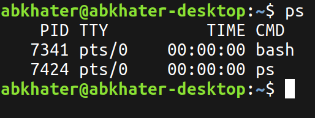

### **Monitor system processes in real-time**

Run the `top` or `htop` command and identify the most CPU-intensive process.

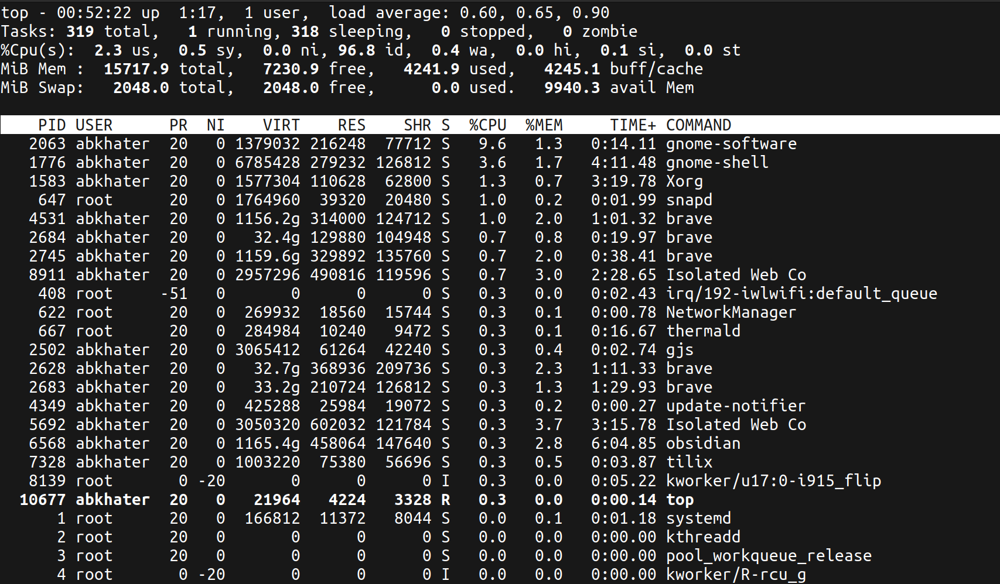

### **Start a background process**

Launch a command like `sleep 30` in the background using `&`.

- Verify it is running using `jobs` or `ps`.

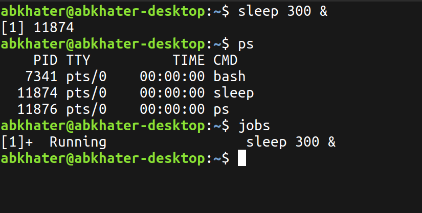

### **Bring a background process to the foreground**

Use `fg` to bring the background process back to the foreground.

### **Suspend and resume a process**

- Start a long-running process (e.g., `ping google.com`).
- Suspend it using `Ctrl+Z` and resume it with `fg` or `bg`.

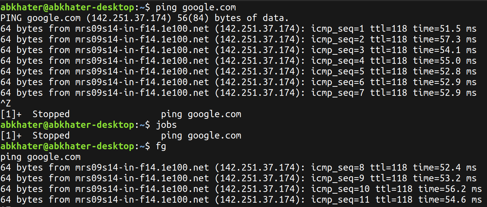

---
## **Intermediate Level**

### **Kill a process by PID**

- Start a process (e.g., `sleep 300`).
- Find its Process ID (PID) using `ps` or `pgrep`.
- Kill it using the `kill` command.

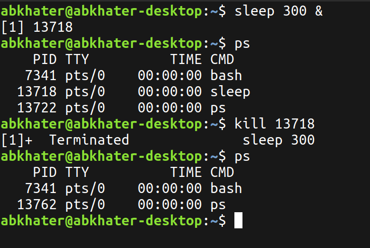

### **Terminate multiple processes**

- Start multiple processes (e.g., `sleep 100`, `sleep 200`).
- Use `pkill` to terminate all processes with a specific name.

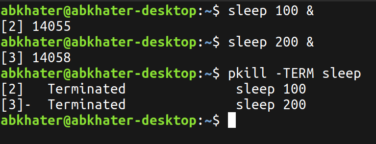

### **Niceness levels**

- Start a command with a low priority using `nice` (e.g., `nice -n 10 sleep 100`).
- Check its priority using `ps -o pid,ni,comm`.
- Change its niceness using `renice`.

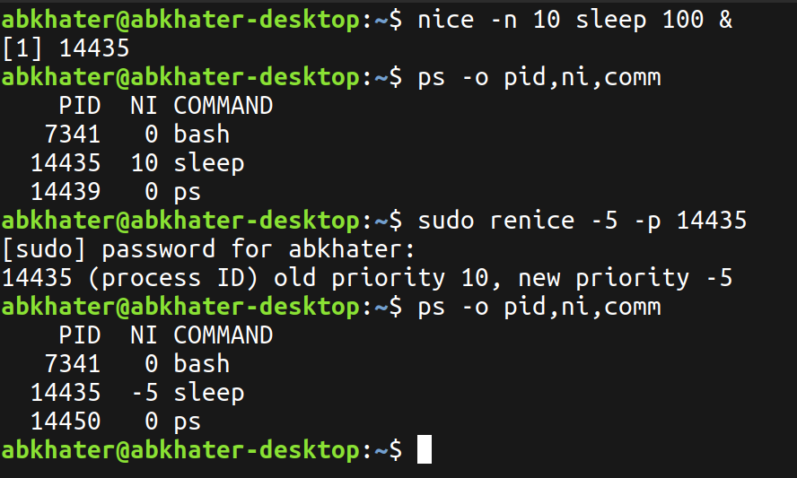

### **View process hierarchy**

Use the `pstree` command to view the parent-child relationships of processes.

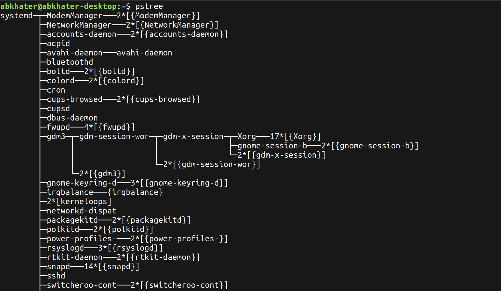

### **Redirect process output**

Run `ping google.com` and redirect its output to a file using `>` or `>>`.

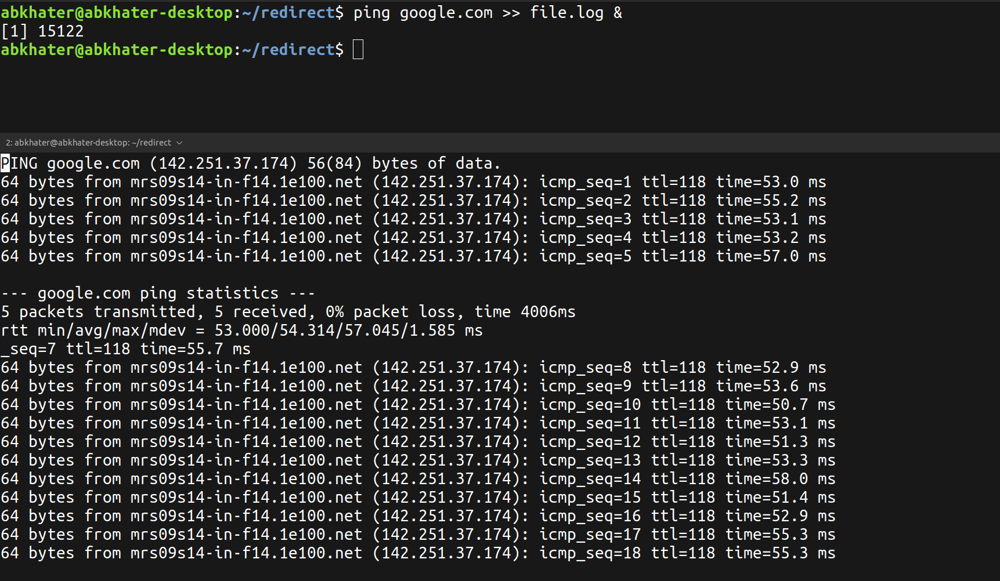

---
## **Advanced Level**

### **Track system calls of a process**

Use `strace` to trace system calls of a command like `ls`.
Example: `strace ls`.

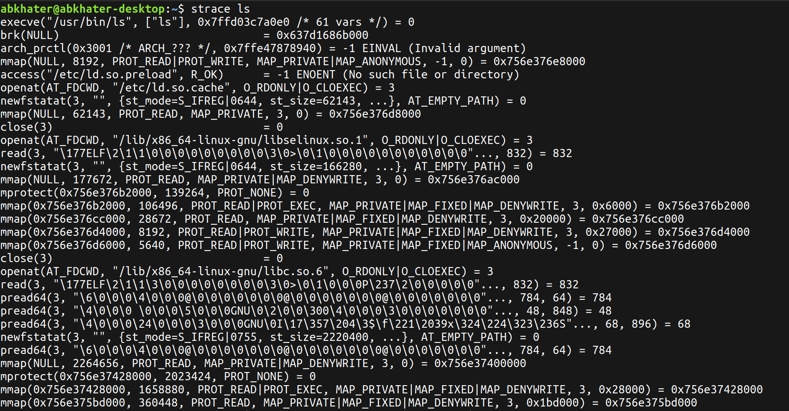

### **Monitor file descriptors**

- Start a process like `vi`.
- Use `lsof -p <PID>` to check the file descriptors in use by the process.

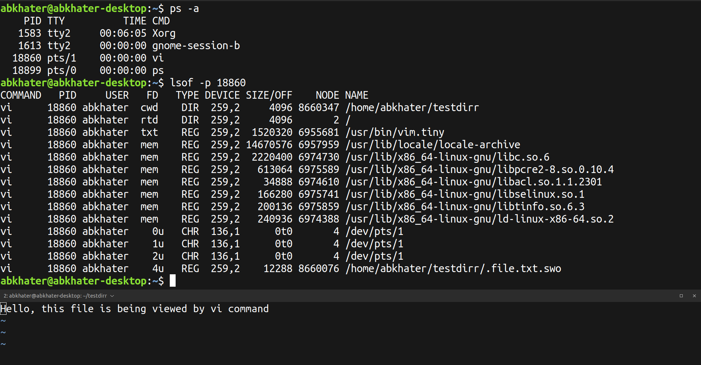

### **Process scheduling policies**

- Start a process with `chrt` to set a real-time scheduling policy.
Example: `chrt -f 10 sleep 100`.
- Check its policy using `ps`.

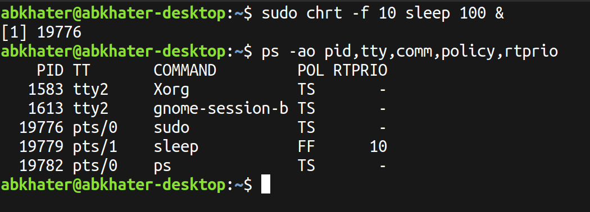

### **Limit resource usage**

- Use `ulimit` to limit the CPU time or memory for a process.
Example: `ulimit -t 5` followed by a CPU-intensive command like `dd if=/dev/zero of=/dev/null`.

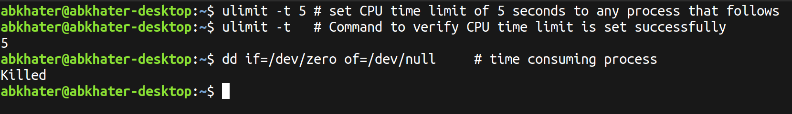

---
