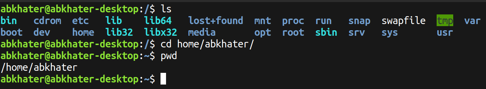
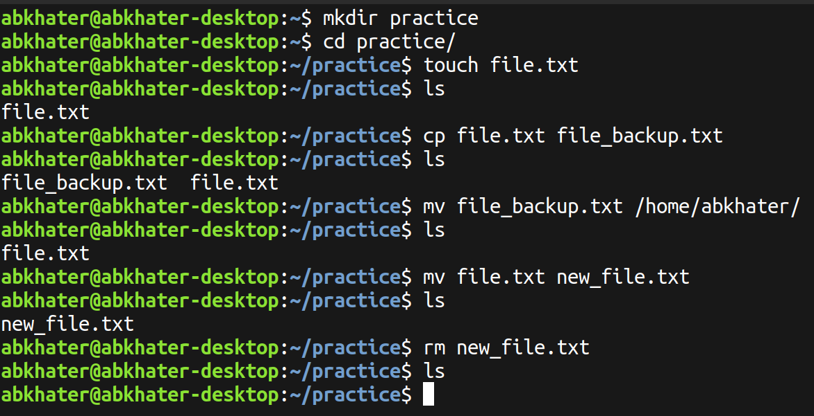
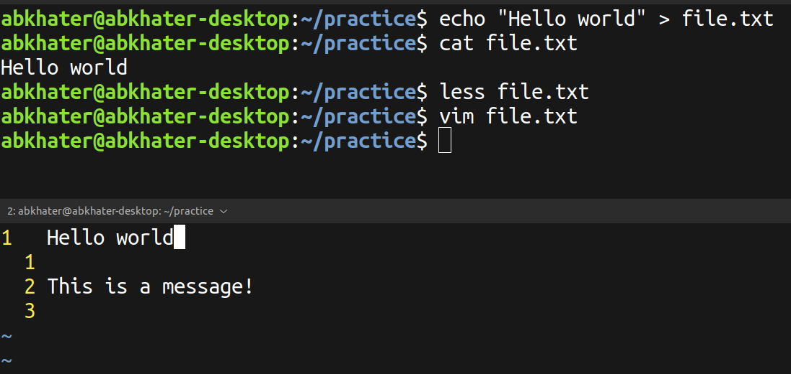
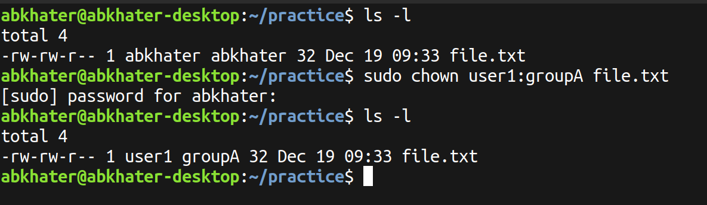
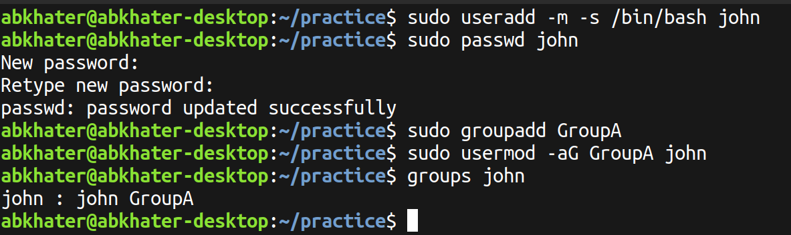
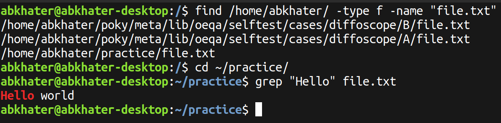

An Exercise Using Various Commands Relating to File Systems

---

# Exercises:

- [Exercise 1: Basic Navigation](#exercise-1-basic-navigation)
- [Exercise 2: File and Directory Operations](#exercise-2-file-and-directory-operations)
- [Exercise 3: File Viewing and Editing](#exercise-3-file-viewing-and-editing)
- [Exercise 4: File Permissions](#exercise-4-file-permissions)
- [Exercise 5: User and Group Management](#exercise-5-user-and-group-management)
- [Exercise 6: File Searching](#exercise-6-file-searching)

---
## Exercise 1: Basic Navigation
- Use `ls` to list all files and directories in the current directory.
- Use `cd` to navigate to a specific directory.
- Use `pwd` to print the current working directory.

## Exercise 2: File and Directory Operations
- Create a directory named “practice” in the current directory using `mkdir`.
- Create an empty file named “file.txt” within the “practice” directory using touch.
- Copy “file.txt” to a new file “file_backup.txt” using `cp`.
- Move “file_backup.txt” to another directory using `mv`.
- Rename “file.txt” to “new_file.txt” using `mv`.
- Delete the “new_file.txt” using `rm`.

## Exercise 3: File Viewing and Editing
Create a text file using `echo` or a text editor like `nano`. View the contents of the file using `cat`. View the contents of the file using `less`. Edit the file using `nano` or another text editor. Redirect the output of a command (e.g., `ls`) to a file using >.

## Exercise 4: File Permissions
Create a file and set specific permissions using `chmod`. Check the permissions of the file using `ls -l`. Change the owner and group of the file using `chown`. Verify the changes using `ls -l`.

## Exercise 5: User and Group Management
Create a new user using `useradd`. Set a password for the new user using `passwd`. Create a new group using `groupadd`. Add the user to the newly created group using `usermod`.

## Exercise 6: File Searching
Use `find` to search for a specific file or directory. Use `grep` to search for a specific string in a file.

